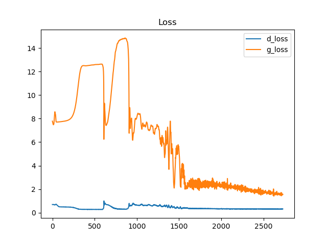

# Generative Adversarial Networks

## Train the model

`python train.py`

## Inference

- `python inference.py`
- Generated image will be stored in `images` folder
- Generated image is not desirable since the model only has been trained for 5 epochs

## Result

